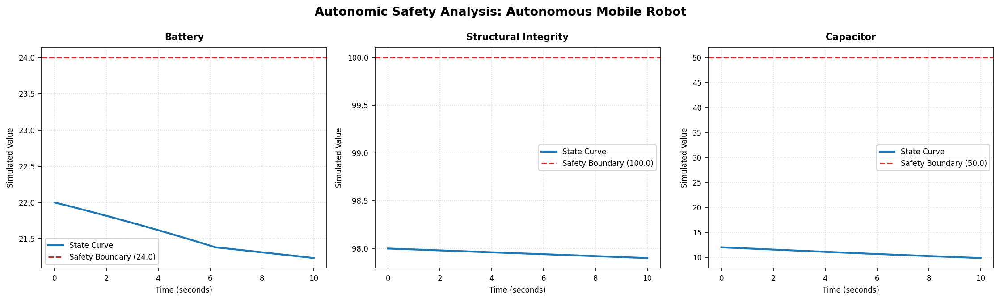
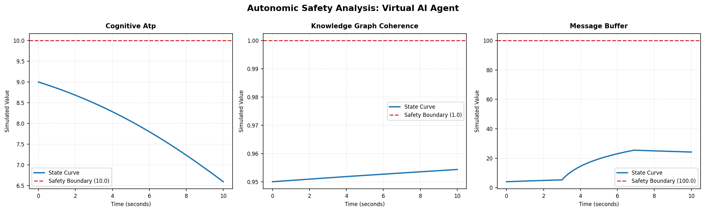
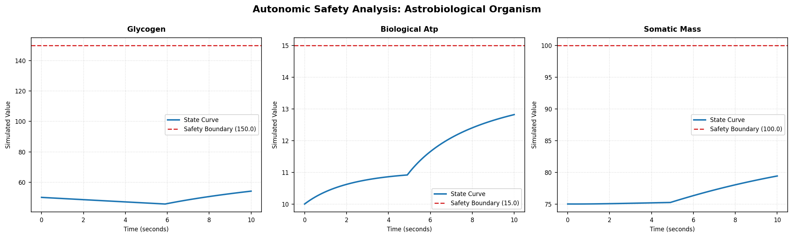

# Autonomic Limits Compiler (CDF v2-UL)

[](https://doi.org/10.5281/zenodo.20779120)
[](https://opensource.org/licenses/MIT)
[](https://www.python.org/downloads/)

An autonomic runtime framework designed to guarantee continuous physical and physiological state boundaries. By compiling raw, unconstrained actuator or decision intentions through a non-linear unconstrained coordinate space (**G-space**), boundary-exceeding states are rendered mathematically and physically unrepresentable within the system's execution plane.

---

## Conceptual Philosophy

In conventional control loops, physical or cognitive limits (such as power reserves, structural capacity, or cognitive bandwidth) are typically protected by external, hard-coded conditional checks (such as `if state > max`). Under high-noise, adversarial, or high-frequency contexts, these boundary checks are prone to discretization, float rounding, or timing failures, leading to system collapse.

The **Autonomic Limits Compiler** replaces external boundary guarding with mathematical construction:
1. **Forward Mapping ($\Phi$)**: Projects bounded physical coordinates ($x$) into an unconstrained, infinite G-space ($g$).
2. **Exact G-Space Integration**: Solves linear differential equations analytically over each discrete timestep, preserving continuous-time safety profiles.
3. **Inverse Pullback ($\Phi^{-1}$)**: Resolves the updated coordinates back to bounded physical space, guaranteeing the values asymptotically hug but *never* cross their maximum boundaries.

---

## System Architecture

The package utilizes a strictly decoupled, one-way import architecture. Prototype implementations are fully decoupled from the dynamic package namespace, preventing circular dependency vectors during direct loading.

```text
autonomic_compiler_root/
│
├── .gitignore
├── requirements.txt
├── README.md
├── main.py                     # Interactive CLI & execution manager
│
├── assets/                     # Diagnostic curves & system diagrams
│   ├── plot_autonomous_mobile_robot.png
│   ├── plot_virtual_ai_agent.png
│   └── plot_astrobiological_organism.png
│
└── autonomic_compiler/
    ├── __init__.py
    ├── math_utils.py           # Transcendental solvers (Lambert W, exact integration)
    ├── boundary_maps.py        # Coordinate projection maps (Ratio, Saturating Exp)
    ├── gates.py                # Competitive lateral inhibition gating
    ├── core.py                 # Core autonomic compilation runtime engine
    │
    └── prototypes/
        ├── __init__.py         # (Kept empty to bypass package circular side-effects)
        ├── base.py             # Abstract BasePrototype interface contract
        ├── amr_robot.py        # Prototype 1: Autonomous Mobile Robot
        ├── ai_agent.py         # Prototype 2: Virtual AI Agent
        └── astrobiology.py     # Prototype 3: Astro-cellular Organism
```

---

## Core Mathematical Projections

For ratio-bounded variables like energy currencies or structural stress, the compiler utilizes the **Ratio Mapping**:

$$\Phi(x) = g = \frac{x}{x_{\max} - x}$$

$$\Phi^{-1}(g) = x = x_{\max} \cdot \frac{g}{1 + g}$$

Because the term $\frac{g}{1+g} < 1.0$ for any finite value of $g$, $x$ is mathematically forced to stay strictly below $x_{\max}$.

### Visualizing Asymptotic Safety

Here is a visual representation of how the compiler naturally bends state trajectories, preventing boundary breaches under extreme stress:

| Autonomous Mobile Robot | Virtual AI Agent | Astrobiological Cell |
| :---: | :---: | :---: |
|  |  |  |

*Note: The red dashed lines in the plots represent the strict limits ($x_{\max}$). State curves (blue) asymptotically flatten as they approach these limits, showing graceful degradation rather than hard crashes.*

---

## Installation

Ensure you have a modern Python environment installed. Clone the repository and install the dependencies:

```bash
# Clone the repository
git clone https://github.com/JPQ-exp/autonomic-compiler-cdf.git
cd autonomic-compiler-cdf

# Install requirements (numpy and matplotlib)
pip install -r requirements.txt
```

---

## Usage

Run the primary execution manager interactively:

```bash
python main.py
```

You will be presented with an interactive menu to load any of the three isolated prototypes, customize simulation steps, and define step sizes ($dt$).

```text
============================================================
       AUTONOMIC COMPILER - INTERACTIVE SIMULATION SUITE
============================================================
Select an isolated prototype to load:
1) Autonomous Mobile Robot (AMR) - Battery & Frame stress
2) Virtual AI Agent - Cognitive ATP & Request Backlog
3) Astrobiological Organism - Cellular Glycogen & Tissue Repair
4) Exit

Enter choice (1-4): 
```

---

## The Three Prototypes (Dynamic Domains)

All prototypes strictly implement the abstract `BasePrototype` contract interface found in `base.py`, enforcing clean Polymorphic evaluation:

### 1. Autonomous Mobile Robot (`amr_robot`)
Simulates an industrial mobile robot coordinating power levels (`battery`), chassis stress (`structural_integrity`), and capacitors (`capacitor`). When battery levels drop, the robot's motor controller scales back its velocity, minimizing kinetic heat dissipation ($v^2$) and preserving remaining runtime.

### 2. Virtual AI Agent (`ai_agent`)
Simulates a digital assistant managing processing units (`cognitive_atp`), database consistency (`knowledge_graph_coherence`), and an incoming message backlog (`message_buffer`). High-traffic events cause memory buffers to fill and deplete energy reserves, slowing processing power to prevent cognitive burnout.

### 3. Astrobiological Organism (`astrobiology`)
A physiological cellular model tracking metabolic glycogen (`glycogen`), cellular ATP (`biological_atp`), and somatic tissue (`somatic_mass`) under highly radioactive external environments. If starvation is triggered, the cell dynamically recycles its own somatic tissue (catabolism) to synthesize ATP, sacrificing structure to maintain metabolic homeostatic survival.

---

## License

This project is licensed under the MIT License - see the [LICENSE](LICENSE) file for details.
